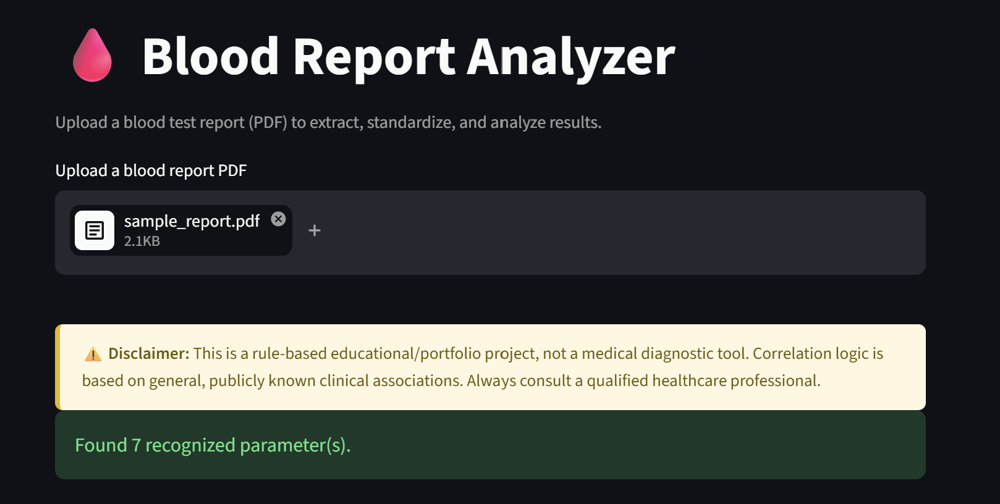
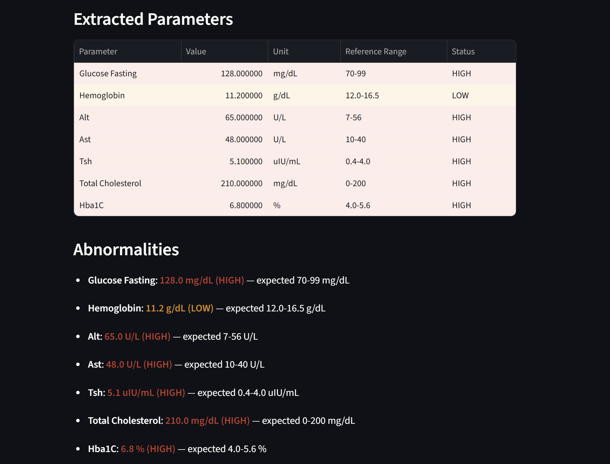
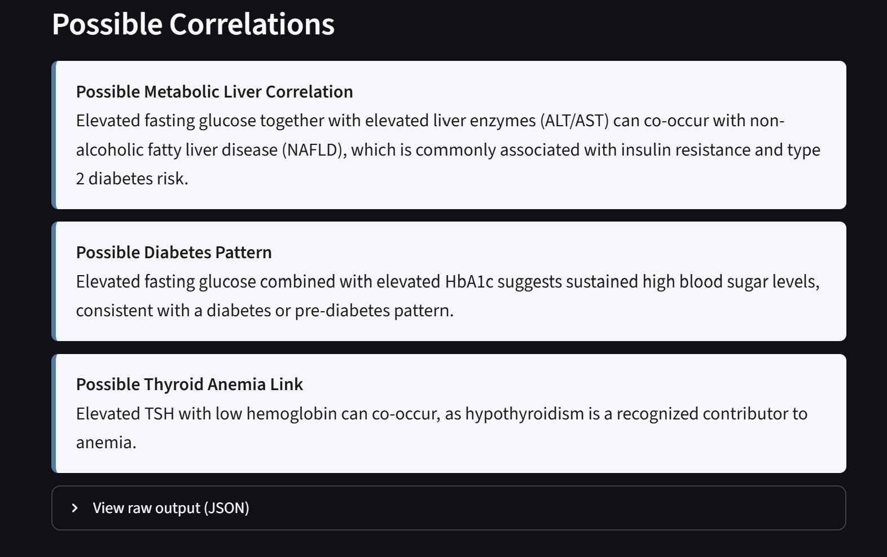

# Blood Report ETL Pipeline

A small **ETL (Extract → Transform → Load) pipeline** that turns unstructured PDF lab reports into clean, schema-validated, queryable data — plus a rule-based analytics layer on top and a Streamlit UI for interactive use.

**Live demo:** [armandaspatt-blood-report-analyser-app-llmfpr.streamlit.app](https://armandaspatt-blood-report-analyser-app-llmfpr.streamlit.app/)
Use `sample_report.pdf` from this repo to try it out quickly.

> ⚠️ **This is an educational/portfolio data engineering project, not a medical diagnostic tool.** The correlation rules are based on general, publicly known clinical associations for demonstration purposes only.

---

## Screenshots

**Ingestion — upload a raw PDF source file**


**Extract + Transform — standardized output with data quality flags**


**Analytics layer — derived cross-field correlations**


---

## Why this is a data engineering project

Lab report PDFs are a classic messy real-world data source: no fixed schema, inconsistent field names across vendors ("SGPT" vs "ALT" vs "Alanine Aminotransferase"), inconsistent units, and text embedded in tables and free text. This project builds the pipeline pattern you'd use for any such source:

| Stage | Concern | Where |
|---|---|---|
| **Extract** | Pull raw, unstructured data out of a semi-structured source (PDF) | `extractor.py` |
| **Transform** | Schema mapping, deduplication of naming variants, type casting, unit normalization, validation against reference ranges | `standardizer.py` |
| **Load / Serve** | Emit a standardized record (JSON) that downstream systems/dashboards can consume | `main.py`, `app.py` |
| **Enrich** | A declarative, config-driven rules engine derives new fields (flags/correlations) from the standardized record — same pattern as a dbt-style transformation/business-rules layer | `rule_engine.py` |
| **Config as data** | Schema (reference ranges + aliases) and business logic (correlation rules) live in versioned JSON, not code, so the pipeline can evolve without redeploying | `config/*.json` |

## Pipeline architecture

**Raw source file (PDF)**

**↓ 1. EXTRACT** — `extractor.py`
- `pdfplumber` pulls raw text + raw tables out of the PDF

**↓ 2. TRANSFORM** — `standardizer.py`
- alias resolution: raw label → canonical field name
- regex parsing: value + unit extraction from text/tables
- type casting: string → float
- schema validation against `config/reference_ranges.json`

→ produces `standardized_data`: `{ field_key: {value, unit, raw_label, status} }`

**↓ 3. ENRICH / RULES** — `rule_engine.py`
- abnormality flags: value vs. reference range
- derived features: cross-field correlation rules (config-driven)

**↓ 4. LOAD / SERVE** — `main.py` (CLI + JSON dump), `app.py` (Streamlit UI)

**→ `last_analysis_output.json`** — machine-readable, ready for a DB/warehouse load

## Data model

Each parsed report is normalized into a flat record keyed by canonical field name:

```json
{
  "glucose_fasting": {"value": 128.0, "unit": "mg/dL", "raw_label": "Fasting Glucose", "status": "HIGH"},
  "hemoglobin":      {"value": 11.2,  "unit": "g/dL",  "raw_label": "Hemoglobin",       "status": "LOW"}
}
```

This is the "silver layer" shape — cleaned and typed, one row per parameter per report. It's intentionally flat and JSON-serializable so it can be:
- loaded straight into a document store, or
- flattened into a `(report_id, parameter, value, unit, status)` fact table for a relational warehouse.

## Data quality handling

- **Schema drift across sources** — different labs label the same test differently. `config/reference_ranges.json` stores an alias list per canonical field; `standardizer.py` resolves raw labels to canonical keys (case-insensitive, punctuation-stripped, partial-match fallback).
- **Validation** — every extracted value is checked against a defined reference range and tagged `HIGH` / `LOW` / normal, so downstream consumers never have to re-derive that logic.
- **Unrecognized fields** — labels that don't match any known alias are dropped rather than silently mis-mapped, and the pipeline reports how many recognized parameters it found per document.
- **Unsupported input** — the extractor currently assumes a text-based (digitally generated) PDF; scanned/image PDFs won't parse and would need an OCR pre-step (see below).

## Business logic as config, not code

Correlation ("enrichment") rules are declarative JSON evaluated in a restricted namespace against the standardized record — the same idea as a rules/feature layer in a modern data stack (e.g. dbt macros or a feature store), kept out of the pipeline code so new logic ships as a config change:

```json
{
  "id": "diabetes_liver_pattern",
  "condition": "high('glucose_fasting') and (high('alt') or high('ast'))",
  "message": "Elevated fasting glucose together with elevated liver enzymes...",
  "flag": "possible_metabolic_liver_correlation"
}
```

## Project structure

```
Blood_Report_Analyser/
├── app.py                         # Streamlit UI (serve layer)
├── main.py                        # CLI orchestrator, runs full ETL + writes JSON
├── extractor.py                   # EXTRACT: PDF -> raw text/tables
├── standardizer.py                # TRANSFORM: raw data -> standardized, validated records
├── rule_engine.py                 # ENRICH: abnormality flags + correlation rules
├── config/
│   ├── reference_ranges.json      # schema: canonical fields, ranges, aliases
│   └── correlation_rules.json     # business rules, config-driven
├── sample_report.pdf              # sample raw source file for the demo
└── requirements.txt
```

## Tech stack

- **Extraction:** `pdfplumber`
- **Transformation / validation:** Python, regex, config-driven schema (`config/reference_ranges.json`)
- **Enrichment / rules:** small expression-based rule engine over a restricted `eval` namespace
- **Serving:** Streamlit (`app.py`), CLI (`main.py`)
- **Data interchange format:** JSON

## Next steps for productionizing

- **Orchestration** — wrap `main.py`'s pipeline call in an Airflow DAG / Prefect flow to batch-process a folder of incoming reports.
- **Load step** — write `last_analysis_output.json` into a warehouse table (`report_id, parameter, value, unit, status, flag`) instead of a flat file.
- **OCR support** — add a Tesseract-based pre-processing step for scanned PDFs so the pipeline can ingest a wider range of source formats.
- **Schema registry** — move `reference_ranges.json` / `correlation_rules.json` into a versioned config store so rule changes are auditable.
- **Testing** — add fixture PDFs covering different lab formats to regression-test the alias-matching logic as it's extended.
- **Historical tracking** — persist standardized records per patient/report over time (e.g. SQLite/Postgres) to support trend analysis, not just single-report snapshots.

## Disclaimer

All correlation logic is based on general, publicly known clinical associations for demonstration purposes. This project does not use proprietary medical data and is not intended to diagnose, treat, or provide medical advice. Always consult a qualified healthcare professional.
